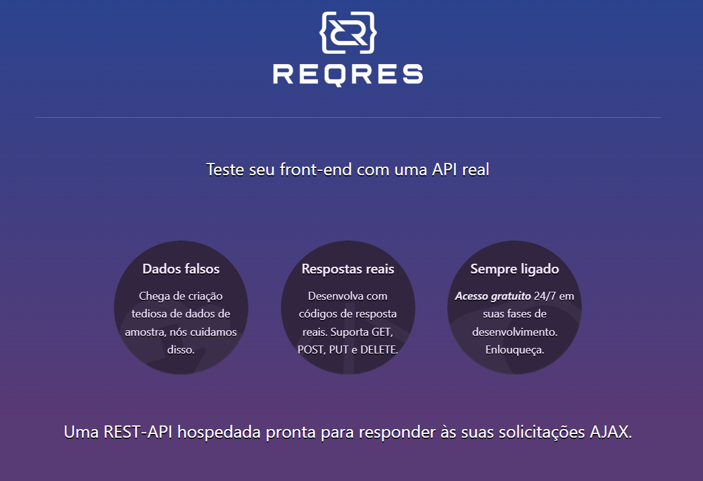

# Projeto de Testes da API Reqres  

Este repositório documenta o conjunto de testes realizados na API [Reqres](https://reqres.in), uma plataforma que simula operações RESTful para fins de desenvolvimento e validação de APIs. O objetivo principal deste projeto foi garantir que os endpoints da API funcionassem conforme o esperado, validando as respostas, os parâmetros de consulta e a consistência dos dados retornados. Assegurei, com isso, uma base confiável para desenvolvedores testarem suas próprias implementações de APIs.

## Detalhes do Teste

### Requisições GET para Listar Usuários

- **Listagem Completa de Usuários:** Realizei requisições para o endpoint `/api/users?page=1` para verificar o retorno de uma lista completa de usuários. Validei que a resposta incluía o status 200 e continha campos como `id`, `email`, `first_name`, e `last_name`.
- **Listagem de Usuários em Páginas Específicas:** Testei o endpoint `/api/users?page=2` para listar usuários na segunda página, garantindo que a resposta incluísse o status 200 e os dados correspondentes.
- **Listagem com Quantidade Específica:** Enviei requisições para `/api/users?per_page=5`, validando que a API retornasse exatamente 5 usuários com status 200.

### Exemplo de Casos de Teste

- **Listagem Bem-Sucedida de Usuários na Página 1:** A API retornou status 200 com a lista correta de usuários.
- **Envio de Parâmetros Inválidos na Listagem:** Testei parâmetros inválidos, como IDs alfanuméricos ou campos vazios. A expectativa era de um 400 Bad Request; no entanto, a API retornou 500 Internal Server Error, o que indicou falhas no tratamento de erro e foi reportado como bug.
- **Listagem sem Parâmetros Necessários:** Realizei testes removendo parâmetros obrigatórios e esperava um status 400 Bad Request, mas em alguns casos, a API retornou 200 OK, sugerindo necessidade de validação adicional.

### Requisições POST para Autenticação

- **Login Bem-Sucedido:** Testei o endpoint `/api/login` enviando credenciais válidas para verificar o retorno de um token de autenticação e um status 200 OK.
- **Login com Credenciais Inválidas:** Enviei credenciais incorretas para garantir que a API retornasse um status 400 com uma mensagem de erro apropriada. Em alguns casos, a API retornou um status 500, sugerindo problemas no tratamento de erros, que foram reportados.

## Ferramentas Utilizadas

- **Postman:** Utilizado para criar e enviar requisições para a API, analisando as respostas e comportamento da API em diferentes cenários.
- **JIRA:** Ferramenta utilizada para documentar e rastrear os bugs encontrados durante os testes, garantindo que as falhas fossem corrigidas antes da implementação final.

## Conclusão

Este projeto de testes da API **Reqres** destaca a robustez e confiabilidade dos endpoints simulados para operações CRUD e autenticação. A execução de testes abrangentes sobre funcionalidades e autenticação assegura que a API **Reqres** oferece uma base sólida para desenvolvedores verificarem implementações de APIs, com respostas consistentes e aderentes aos padrões de qualidade esperados.
